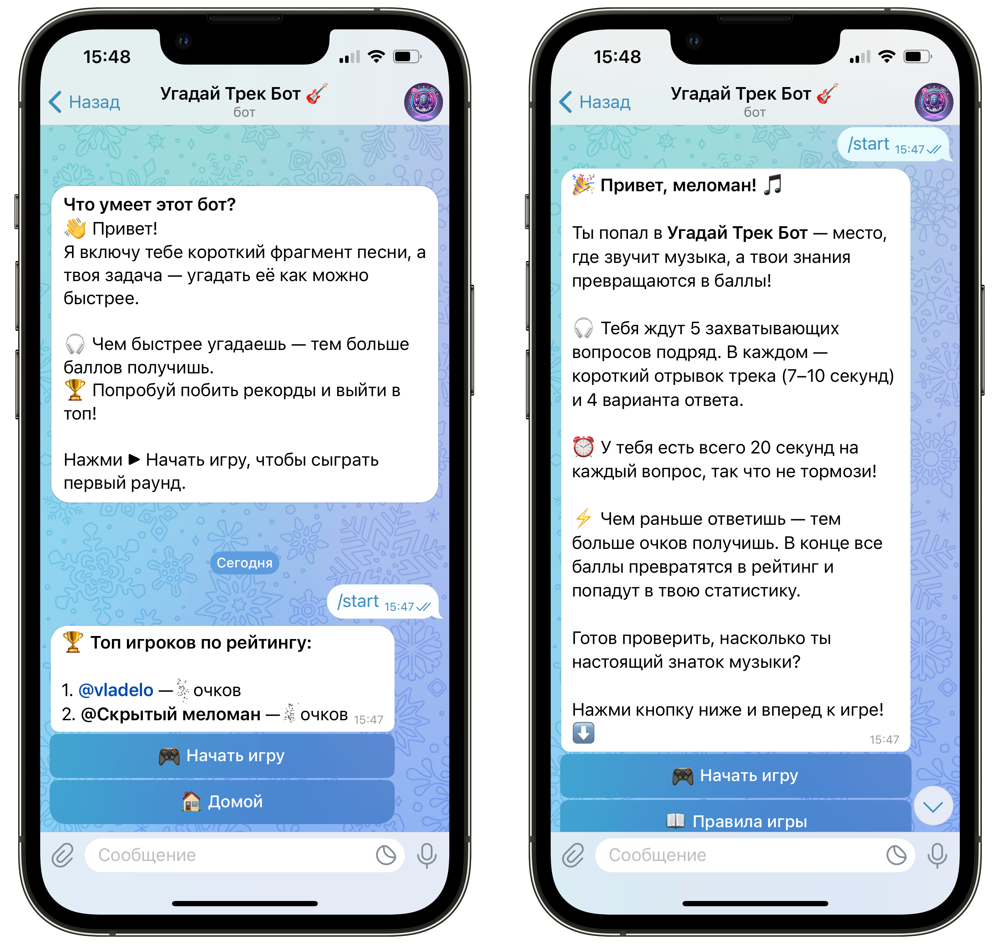
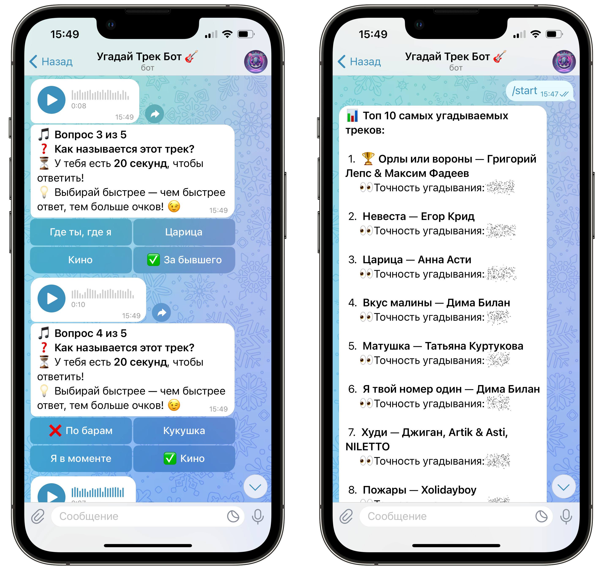

### 🚀 **[👉 Перейти к боту в Telegram](https://t.me/song_sniper_bot)**

[](https://docs.aiogram.dev/)
[](https://www.python.org/)
[](https://docs.python.org/3/library/asyncio.html)
[](https://www.sqlalchemy.org/)
[](https://www.sqlite.org/index.html)
[](https://alembic.sqlalchemy.org/)
[](https://pypi.org/project/python-dotenv/)
[](https://docs.python.org/3/library/random.html)
[](https://docs.python.org/3/library/os.html)
[](https://docs.python.org/3/library/logging.html)
[](https://www.docker.com/)

# 🎸 **Угадай Трек Бот** 

**🎵 Угадай трек** — это увлекательный Telegram-бот с музыкальными викторинами, который подарит массу эмоций и проверит
твои знания музыки.  
Бот воспроизводит случайный отрывок песни длительностью **7–10 секунд**, а твоя задача — выбрать правильный ответ из
четырёх вариантов.  
Соревнуйся с друзьями, набирай очки и занимай верхние строчки в таблице лидеров!

🚀 **[Перейти к боту в Telegram](https://t.me/song_sniper_bot)**

---

## ✨ Возможности

- 🎧 **Отрывки песен** — случайный выбор из базы 100+ треков
- 📝 **4 варианта ответа** — один правильный
- ⏳ **Ограничение по времени** — чем быстрее ответ, тем больше баллов
- 🏆 **Таблица лидеров** — соревнуйся с другими игроками
- 📊 **Статистика игрока** — количество сыгранных игр, общие очки
- ➕ **Лёгкое добавление треков** — расширяй базу без изменения кода

---






---

## 🛠 Технологии

- **[Aiogram](https://docs.aiogram.dev/)** — асинхронный фреймворк для создания Telegram-ботов на Python.  
  Позволяет удобно обрабатывать команды, текстовые сообщения, инлайн- и reply-кнопки, а также работать с контекстом
  пользователей. Поддерживает фильтры, FSM и middlewares.


- **[SQLAlchemy](https://www.sqlalchemy.org/)** — мощная ORM-библиотека для работы с базой данных.  
  Применяется для хранения информации об игроках, матчах и статистике. Используется как с декларативными моделями, так и
  с ручными запросами.


- **[Alembic](https://alembic.sqlalchemy.org/)** — инструмент управления миграциями базы данных.  
  Позволяет отслеживать изменения в моделях и автоматически генерировать SQL-команды для обновления структуры БД без
  потери данных.


- **[SQLite](https://www.sqlite.org/index.html)** — встроенная реляционная база данных.  
  Проста в использовании, не требует отдельного сервера и отлично подходит для небольших проектов. Все данные хранятся в
  одном `.sqlite3` файле.


- **[Asyncio](https://docs.python.org/3/library/asyncio.html)** — стандартная библиотека Python для асинхронного
  программирования.  
  Обеспечивает высокую производительность, параллельную обработку сообщений и работу с задержками (например, таймеры и
  автоудаление игр).


- **[Python-dotenv](https://pypi.org/project/python-dotenv/)** — утилита для загрузки переменных окружения из `.env`
  файла.  
  Упрощает конфигурацию: токены, секреты и параметры подключения удобно хранить вне кода.


- **[Logging](https://docs.python.org/3/library/logging.html)** — встроенный модуль логирования Python.  
  Используется для ведения журнала событий: действий игроков, ошибок и операций с базой.


- **[Docker](https://www.docker.com/)** — контейнеризация приложения.  
  Позволяет легко развернуть бота на любом сервере без ручной настройки окружения.


- **[Pydantic](https://docs.pydantic.dev/)** — для валидации конфигурации и моделей данных (может использоваться в
  `config.py`).

---

## 🗄️ Структура базы данных

Бот использует SQLite для хранения информации о песнях, пользователях и статистике игр.  
Ниже представлена схема таблиц и их назначение.

### 1. **songs** — Песни и отрывки

Хранит информацию о песнях и аудиофайлах с отрывками.

| Поле        | Тип        | Описание              |
|-------------|------------|-----------------------|
| `id`        | INTEGER PK | Уникальный ID песни   |
| `title`     | TEXT       | Название песни        |
| `artist`    | TEXT       | Исполнитель           |
| `category`  | TEXT       | Жанр / категория      |
| `year`      | INTEGER    | Год выпуска           |
| `clip_path` | TEXT       | Путь к mp3 с отрывком |
| `full_path` | TEXT       | Путь к полному треку  |

---

### 2. **players** — Пользователи бота

Хранит данные о зарегистрированных пользователях.

| Поле          | Тип        | Описание             |
|---------------|------------|----------------------|
| `id`          | INTEGER PK | Локальный ID         |
| `tg_id`       | INTEGER    | ID в Telegram        |
| `tg_username` | TEXT       | Никнейм в Telegram   |
| `total_games` | INTEGER    | Всего сыграно игр    |
| `total_score` | INTEGER    | Набранные очки       |
| `first_seen`  | TIMESTAMP  | Дата регистрации     |
| `last_seen`   | TIMESTAMP  | Последняя активность |

---

### 3. **game_sessions** — Игровые сессии

Хранит историю проведённых квизов.

| Поле              | Тип        | Описание                        |
|-------------------|------------|---------------------------------|
| `id`              | INTEGER PK | Уникальный ID сессии            |
| `player_id`       | INTEGER FK | Ссылка на игрока (`players.id`) |
| `score`           | INTEGER    | Очки, набранные в сессии        |
| `questions_count` | INTEGER    | Количество вопросов в сессии    |
| `played_at`       | TIMESTAMP  | Дата и время игры               |

---

### 4. **stats_songs** — Статистика по трекам

Хранит аналитику использования песен в игре.

| Поле            | Тип        | Описание                         |
|-----------------|------------|----------------------------------|
| `song_id`       | INTEGER PK | Идентификатор песни (`songs.id`) |
| `times_played`  | INTEGER    | Количество использований трека   |
| `correct_count` | INTEGER    | Количество правильных ответов    |
| `wrong_count`   | INTEGER    | Количество неправильных ответов  |

---

## 📂 Структура проекта

```
Song-Hunter-Bot/
├── Dockerfile                  # Docker-конфигурация для сборки контейнера
├── README.md                   # Описание проекта
├── alembic.ini                 # Конфиг Alembic
├── db.sqlite3                  # Основная база данных
├── requirements.txt            # Зависимости проекта
│── .env                        # Файл с токеном бота (НЕ добавляется в Git)
│── .env.template               # Шаблон .env файла
│── .gitignore                  # Исключаем .env, __pycache__, venv и прочее
│── .dockerignore               # Исключаем ненужное из Docker-образа
│
├── photos/                     # Папка с изображениями для README
│   ├── Example-photo1.png
│   └── Example-photo2.png
│
├── alembic                     # Миграции базы данных
│   ├── env.py                  # Конфигурация миграций
│   ├── script.py.mako          # Шаблон миграций
│   └── versions                # Скрипты миграций
│       └── 4aa8895bc85e_init_db.py
│
├── app                         # Основной код приложения
│   ├── __init__.py             # Модуль приложения
│   ├── bot.py                  # Точка входа — запуск бота
│   ├── config.py               # Конфигурация
│   ├── database.py             # Подключение к БД
│   ├── db.sqlite3              # Локальная база данных SQLite
│   ├── dependencies.py         # Зависимости для DI
│   ├── logger.py               # Логгирование
│   ├── states.py               # Состояния FSM
│   │
│   ├── db_utils                # Работа с БД — утилиты для моделей
│   │   ├── __init__.py
│   │   ├── add_songs_to_db.py  # Скрипт добавления песен
│   │   ├── game.py             # Логика игр в БД
│   │   ├── player.py           # Игроки в БД
│   │   ├── song.py             # Песни в БД
│   │   └── stats_songs.py      # Статистика по песням
│   │
│   ├── handlers                # Обработчики событий бота
│   │   ├── __init__.py
│   │   ├── game.py             # Игровая логика
│   │   ├── home.py             # Главное меню
│   │   ├── profile.py          # Профиль пользователя
│   │   ├── rating.py           # Рейтинг игроков
│   │   ├── register.py         # Регистрация хендлеров
│   │   ├── rules.py            # Правила игры
│   │   ├── start.py            # Команда /start
│   │   ├── start_game.py       # Запуск игры
│   │   └── stats_songs.py      # Статистика по песням
│   │
│   ├── keyboards               # Клавиатуры для бота
│   │   ├── __init__.py
│   │   ├── game_keyboard.py    # Клавиатура в игре
│   │   ├── start_keyboard.py   # Клавиатура стартового меню
│   │   └── to_home_keyboard.py # Клавиатура возврата домой
│   │
│   ├── messages                # Тексты сообщений и константы
│   │   ├── __init__.py
│   │   └── texts.py            # Тексты бота
│   │
│   ├── models                  # ORM-модели для базы данных
│   │   ├── __init__.py
│   │   ├── base.py             # Базовая модель
│   │   ├── game_session.py     # Сессии игр
│   │   ├── player.py           # Модель игрока
│   │   ├── song.py             # Модель песни
│   │   └── song_stat.py        # Статистика по песням
│   │
│   └── utils                   # Вспомогательные функции
│       ├── __init__.py
│       ├── format_player_stats.py
│       ├── format_rating_stats.py
│       ├── format_song_stats.py
│       └── safe_username.py
└── clips                       # Аудио-файлы песен для викторины
     └── ...
```

### ✅ Преимущества архитектуры проекта

- **Чёткое разделение ответственности**  
  Логика бота разбита по слоям: обработчики (`handlers`), бизнес-логика (`services`), работа с БД (`db_utils`),
  утилиты (`utils`), тексты (`messages`) — это упрощает навигацию и поддержку кода.


- **Принцип единой ответственности (SRP)**  
  Каждый модуль выполняет строго одну задачу.


- **Масштабируемость**  
  Проект легко расширяется: можно добавлять новые команды, функции, модели без риска "сломать" существующий функционал.


- **Переиспользуемость кода**  
  Повторяющаяся логика вынесена в сервисы и утилиты. Это повышает читаемость и снижает дублирование кода.


- **Гибкая работа с БД**  
  Используется SQLAlchemy + Alembic для управления схемой БД, что упрощает миграции и поддержку данных.


- **Инфраструктура готова к деплою**  
  В проекте предусмотрены `Dockerfile`, `.env`, `.dockerignore`, что позволяет быстро развернуть бота на сервере или в
  контейнере.


- **Удобство для команды разработки**  
  Новым разработчикам будет просто разобраться в проекте — структура интуитивно понятна и документирована комментариями.


- **Модульность**  
  Благодаря модульной структуре можно писать unit-тесты на отдельные компоненты без запуска всего бота.

---

## 🛠️ **Технические детали**

- 🐍 Язык программирования: **Python**
- 🤖 Фреймворк: **Aiogram**
- 🗃️ Хранение данных: **SQLite** с использованием **SQLAlchemy** и миграций через **Alembic**
- 🔄 Асинхронность: реализована через **asyncio** для высокой производительности

---

## 📝 **Установка и запуск**

### 🔧 Вариант 1: Локальный запуск

1. 🗃️ Клонируйте репозиторий:
   ```bash
   git clone https://github.com/vladelo777/Song-Hunter-Bot.git
   ```
2. 📂 Перейдите в папку проекта:
   ```bash
   cd Song-Hunter-Bot
   ```
3. 📦 Установите зависимости:
   ```bash
   pip install -r requirements.txt
   ```
4. ⚙️ Создайте `.env` на основе `.env.template` и укажите ваш токен:
   ```bash
   cp .env.template .env
   ```
5. 🛠️ Примените миграции базы данных:
    ```bash
   alembic upgrade head
   ```
   
6. 🗄️ Наполните БД треками:
   ```bash
   python app/db_utils/add_songs_to_db.py
   ```

7. 🚀 Запустите бота:
   ```bash
   python app/bot.py
   ```

### 🐳 Вариант 2: Запуск через Docker

1. Клонируйте репозиторий:
   ```bash
   git clone https://github.com/vladelo777/Song-Hunter-Bot.git
   ```
2. Перейдите в папку проекта:
   ```bash
   cd Song-Hunter-Bot
   ```
3. Создайте `.env` на основе `.env.template` и укажите ваш токен:
   ```bash
   cp .env.template .env
   ```
4. Постройте и запустите контейнер:
   ```bash
   docker build -t song-hunter-bot . && docker run -it --env-file .env song-hunter-bot
   ```

---

## 🛠 **Дополнительно**

- Чтобы скрыть `BOT_TOKEN`, **не загружай `.env` в Git** (он уже в `.gitignore`).


- Бот поддерживает ReplyKeyboardMarkup и KeyboardButton для функционирования кнопок управления.


- База данных SQLite **создаётся автоматически** при первом запуске миграций с помощью Alembic, поэтому никаких
  дополнительных действий по созданию базы не требуется.


- Все изменения структуры базы данных **управляются миграциями**, которые необходимо применять перед запуском бота.

---

## 📬 **Контакты**

🚀 **[Перейти к боту в Telegram](https://t.me/song_sniper_bot)**

Автор: Владислав Лахтионов  
GitHub: [vladelo777](https://github.com/vladelo777)  
Telegram: [@vladelo](https://t.me/vladelo)

💌 Не забудьте поставить звезду ⭐ на GitHub, если вам понравился бот! 😉